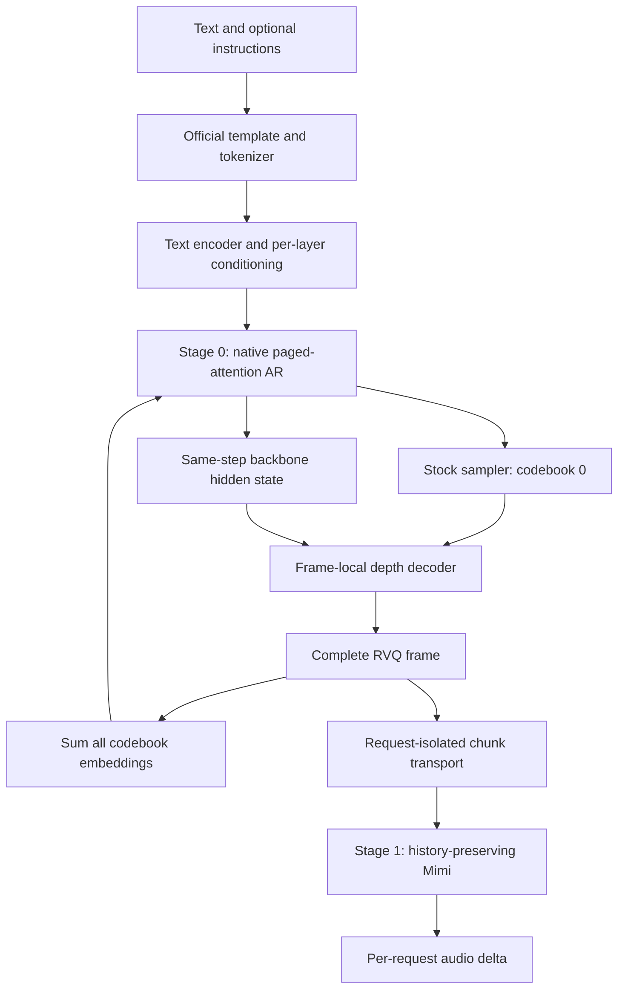

# Native pipeline architecture

[Overview](../README.md) · [Validation](validation.md) · [Roadmap](roadmap.md)

## AR and complete-frame feedback

The temporal AR backbone uses vLLM paged attention. The scheduler samples
codebook 0. An opt-in post-sampling callback completes the remaining codebooks
using the **same step's** backbone hidden state. The next AR input is the sum
of every codebook embedding in that completed frame.

This keeps the first frame and the final token-limit frame on the producing
sampling step. Codec values `[0, codebook_size)` are valid, including all-zero
frames. Reserved codec classes are masked; the separate backbone EOS is
`vocab_size` and never reaches depth or Mimi.

## Text conditioning

The adapter applies `[S0]` and optional `<ins_bos>...<ins_eos>` instructions,
matching the official tokenizer encode/decode/encode sequence. Scheduler
prefill IDs are zero placeholders inside the codec vocabulary. Actual text
IDs and segment lengths travel in `additional_information`.

The full prompt is encoded once per request, then sliced for chunked prefill.
Its conditioning cache is released when prefill completes. If KV preemption
replays the prompt, conditioning is recomputed. Historical complete RVQ frames
are replayed as AR inputs without drawing new depth samples.
Segments are encoded independently with reset positions. Linear, MLP and
`breeze_dimfusion` projections are implemented, including selected encoder
layers and optional first-layer fusion. Later DimFusion features replace the
second half of text-position activations before the native layer normalizes
them. The native deferred residual is materialized before this replacement.
Generated audio positions keep the full AR activation.

T5Gemma module encoders and the official T5Gemma 2 compatibility encoder are
supported by the constructor. Unknown projection formats fail explicitly.
Voice cloning and multi-branch CFG are outside this initial request contract.

## Depth decoding and weights

Depth uses the official Breeze attention, without Qwen3 Q/K normalization.
Backbone and audio inputs are both projected through the depth input
projection. Codebook-position offsets and position-specific heads match the
checkpoint. Its KV cache is created for one frame and discarded afterward.
Greedy and temperature/top-k/top-p sampling are implemented. Each request
owns its RNG, so changing batch membership does not share depth randomness.

Stage 0 loads backbone, text conditioning, depth and LM-head weights. Stage 1
loads Mimi. Missing parameters fail startup. Fused native qkv/gate-up tensors
require every source shard; tied audio embeddings are recognized by identity.
Mimi's persistent quantizer buffers are required, as well as its parameters.

## Transport, waveform and lifecycle

Transport preserves `[frames, codebooks]`. Async buffers use the connector's
standard request maps, allowing its cancellation cleanup to remove them.
The producer signatures also support full-payload execution. An empty final
chunk carries both a scheduler boundary and a terminal flag, allowing Mimi
to flush its held-back tail without inventing an audio frame.

Mimi retains the entire code history per request and re-decodes the complete
prefix. This preserves transformer, upsampler and convolution context.
Streaming holds back two codec frames, emits only new samples and checks that
previously emitted samples remain stable. A changing prefix raises an error;
disable `codec_streaming` for that configuration. Non-streaming waits for the
terminal chunk and decodes the complete request. Cancellation, final chunks
and decode errors remove state. Audio tensors remain a per-request list.

Prefix replay has quadratic total decode work across many chunks. It is a
correctness baseline, not an optimized streaming codec cache.

## Initial runtime constraints

Native Breeze/llama-like and Qwen3 backbones are selected from the checkpoint.
External backbone configurations must be embedded in `backbone_config`.
The initial native path requires eager execution, synchronous AR scheduling,
disabled prefix caching, tensor/pipeline parallel size 1, and no quantization
or speculative decoding. The development YAML applies those settings.

CPU tests validate tensor math, conditioning, transport and callbacks. Actual
CUDA paged attention, complete checkpoints and serving behavior remain
separate validation gates; see [validation](validation.md).
